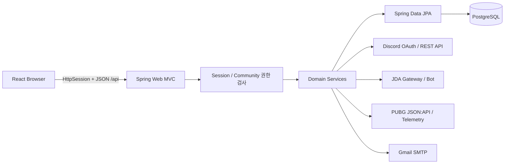
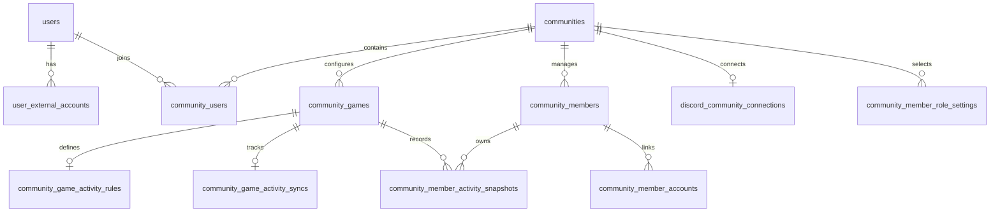
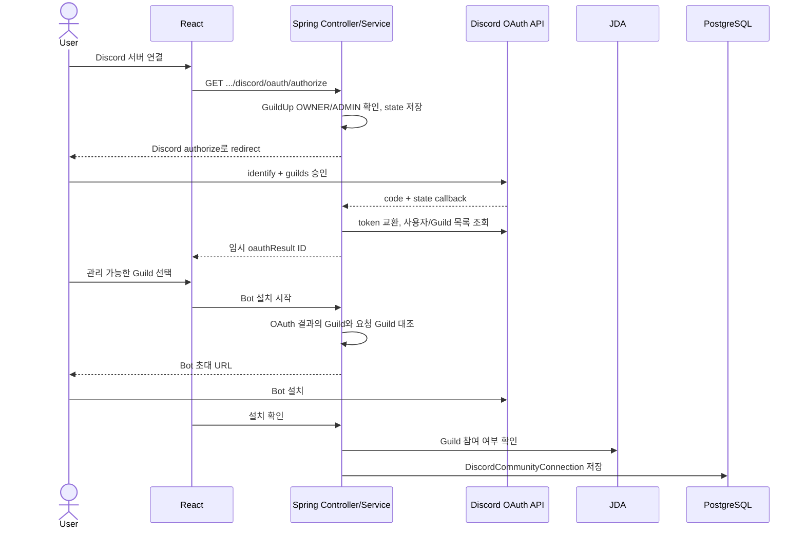
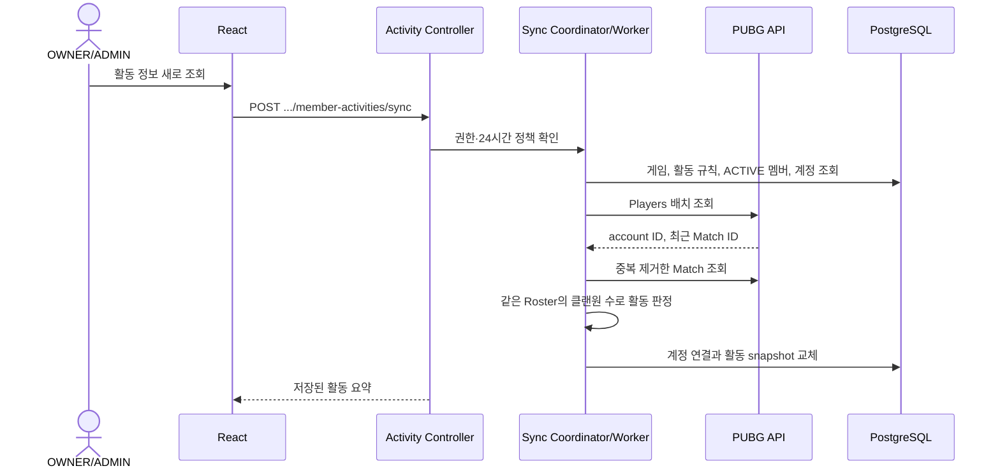
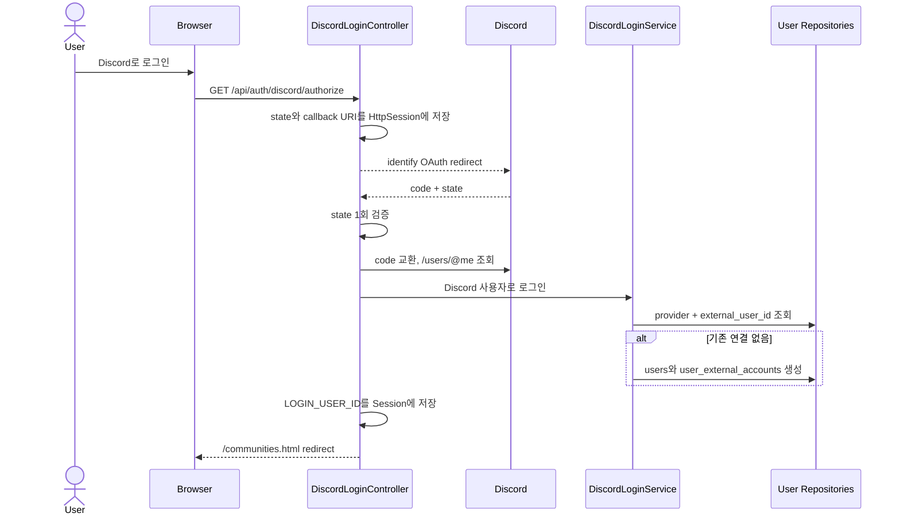
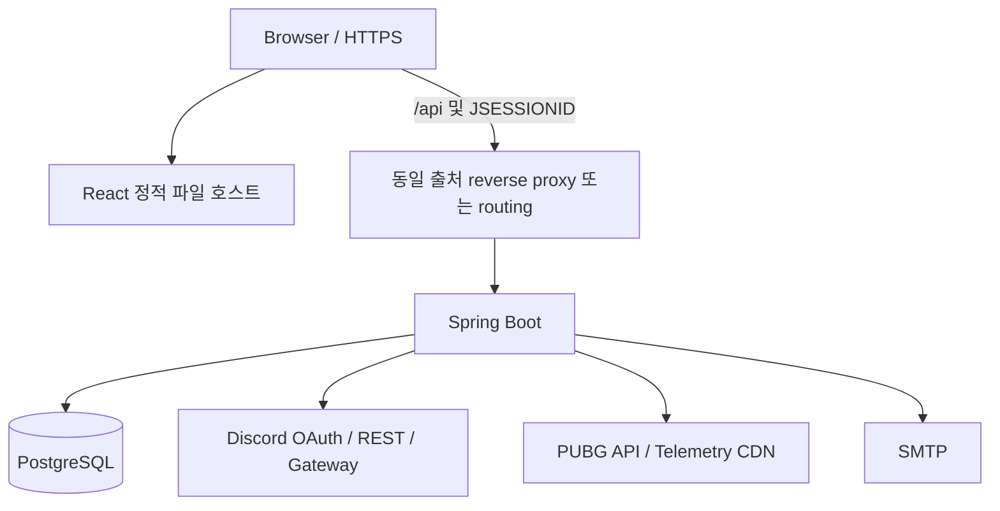

# GuildUp

GuildUp은 게임 커뮤니티와 클랜의 회원, 활동, 콘텐츠를 한곳에서 운영하기 위한 웹 서비스다. 현재 구현은 Discord와 PUBG를 중심으로 동작하지만, 내부 사용자와 외부 계정, 커뮤니티와 게임 설정을 분리하여 장기적으로 여러 게임과 외부 플랫폼을 수용할 수 있는 구조를 지향한다.

이 문서는 2026-09-17 현재 저장소의 Controller → Service → Repository/JDA/외부 API 호출 흐름을 기준으로 작성했다. 기획 아이디어와 구현 완료 기능을 구분하며, 저장소에서 확인할 수 없는 운영 환경은 사실로 단정하지 않는다.

## 현재 구현 범위

### 일반 클랜원

- Discord OAuth로 GuildUp 사용자 생성 및 로그인
- 커뮤니티 생성, Discord 서버 소속을 확인한 커뮤니티 탐색과 `MEMBER` 가입
- 커뮤니티 대시보드, 클랜원 목록, 공지와 이벤트 조회
- Discord 계정과 동기화된 클랜원 기준 일일 출석, 점수, 랭킹 조회
- PUBG 킬내기 생성·참가와 생성자 권한의 모집·팀 편성·정산·결과 발표
- 진행 중이거나 예정된 PUBG 빙고 조회와 개인 진행도 확인
- 문의/건의를 SMTP 메일로 전송

### 운영진 (`OWNER`, `ADMIN`)

- Discord 서버 연결과 GuildUp Bot 설치
- Discord 역할 조회 및 클랜원 판별 역할 설정
- Discord 멤버 전체 동기화와 역할·가입·탈퇴 이벤트 기반 실시간 반영
- PUBG 인게임 닉네임 추출 규칙 설정, 클랜 활동 동기화와 경기 상세 조회
- PUBG 시즌 평균 딜량 기반 팀 편성 및 재편성
- Discord 대상자 선택 DM, 최근 14일 음성 채널 활동 조회
- 공지·이벤트 작성/수정/삭제
- 킬내기 취소, 빙고 생성·집계·종료

### `OWNER` 전용

- GuildUp 커뮤니티 사용자의 `ADMIN`/`MEMBER` 역할 변경

## 주요 화면

| 구분 | 화면 | 접근 범위 |
|---|---|---|
| 공개 | 로그인, 서비스 소개, 이용약관, 개인정보 처리방침 | 전체 |
| 커뮤니티 선택 | 내 커뮤니티, Discord 기반 가입 가능 커뮤니티, 커뮤니티 생성 | 로그인 사용자 |
| 공통 메뉴 | 대시보드, 공지·이벤트, 클랜원, 랭킹, 킬내기, 빙고, 문의/건의 | `OWNER`, `ADMIN`, `MEMBER` |
| 관리 메뉴 | 활동, 팀 만들기, 연동 기능, 설정 | `OWNER`, `ADMIN` |
| Discord 관리 | 서버 연결, 역할별 멤버, DM, 음성 활동 | `OWNER`, `ADMIN` |

프론트엔드는 React Router를 사용하되 기존 URL 호환을 위해 `/community-dashboard.html`, `/members.html` 같은 `.html` 경로를 유지한다. 커뮤니티 화면은 `communityId` 쿼리 파라미터를 사용한다.

## 기술 스택

### Backend

- Java 21
- Spring Boot 4.1.1
- Spring Web MVC, Spring Data JPA, Spring Mail
- PostgreSQL, Hibernate/JPA
- JDA 6.4.1
- Maven Wrapper 3.9.16

인증은 현재 Spring Security가 아니라 `HttpSession`과 Spring MVC `HandlerInterceptor`, 서비스 계층 권한 검사로 구현되어 있다.

### Frontend

- React 19 (`package-lock.json` 해석 버전 19.2.8)
- React Router DOM 7.18.4
- Vite 7 (`package-lock.json` 해석 버전 7.3.6)
- JavaScript, 자체 CSS
- Node.js `^20.19.0` 또는 `>=22.12.0` (설치된 Vite의 engine 요구사항)

### Test

- JUnit 6 / Spring Boot Test / MockMvc / Mockito
- H2 in-memory database
- Node.js 내장 test runner
- Discord/JDA, PUBG, SMTP 외부 호출 mock

## 시스템 아키텍처



대표적인 실제 호출 경로는 다음과 같다.

| 기능 | 호출 흐름 |
|---|---|
| 로그인 | React → `/api/auth/discord/*` → `DiscordLoginController` → `DiscordLoginService` → Discord REST API → User Repository |
| Discord 연결 | React → Discord OAuth/봇 설치 Controller → OAuth/Install Service → Discord REST API/JDA → `DiscordCommunityConnectionRepository` |
| 클랜원 동기화 | React 또는 JDA 이벤트 → Sync Service → JDA 멤버/역할 → `CommunityMember`/`CommunityMemberAccount` Repository |
| PUBG 활동 | React → Activity Controller → Sync Coordinator/Worker → PUBG Players/Match API → 활동 판정 → Snapshot Repository |
| 공지·이벤트 | React → Notice/Event Controller → Service → JPA Repository |
| 킬내기·빙고 | React → 기능 Controller → 도메인 Service → PUBG API/Telemetry → 기능별 Repository |

## 계정과 핵심 데이터 모델

`users`가 GuildUp 서비스의 사용자 Identity다. Discord는 로그인 수단이면서 `user_external_accounts`에 연결되는 외부 계정이다. Discord 서버의 클랜원은 GuildUp 로그인 사용자와 다른 개념이므로 `community_members`와 `community_member_accounts`에서 별도로 관리한다.



- `user_external_accounts`: GuildUp 사용자와 외부 계정의 연결. 현재 실제 로그인 흐름은 Discord만 사용한다.
- `community_users`: GuildUp 사용자와 커뮤니티의 가입 및 권한 관계.
- `community_games`: 현재 `BATTLEGROUNDS_KAKAO`, `BATTLEGROUNDS_STEAM`을 지원한다.
- `community_members`: 커뮤니티가 관리하는 실제 클랜원. Discord 역할 동기화 또는 수동 등록으로 생성된다.
- `community_member_accounts`: 클랜원과 Discord/PUBG 계정을 연결한다.
- `discord_community_connections`: 커뮤니티와 Discord Guild의 1:1 연결이다. 같은 Guild의 중복 연결도 막는다.
- 활동, 점수, 공지, 킬내기, 빙고, 음성 세션은 각각 별도 엔티티와 테이블에 저장된다.

`ExternalAccountProvider`에는 `DISCORD`, `PUBG`, `MAPLESTORY`, `RIOT`가 정의되어 있지만 MapleStory와 Riot 연동 구현은 없다. 실제 게임 설정은 두 PUBG shard만 제공한다.

## 인증과 권한

Discord 로그인은 `identify` scope만 요청한다. 콜백에서 Discord ID로 `user_external_accounts`를 찾고, 계정이 없으면 `users`와 외부 계정 행을 만든 뒤 `LOGIN_USER_ID`를 `HttpSession`에 저장한다. Discord access token과 refresh token은 DB나 브라우저에 저장하지 않는다.

| 역할 | 의미 | 주요 권한 |
|---|---|---|
| `OWNER` | 커뮤니티 생성자 또는 소유자 | 모든 관리 기능, `ADMIN`/`MEMBER` 역할 변경 |
| `ADMIN` | GuildUp 내부 운영진 | Discord/PUBG 설정, 동기화, 콘텐츠 관리 |
| `MEMBER` | GuildUp 커뮤니티 일반 사용자 | 공통 콘텐츠 이용, 출석, 랭킹, 킬내기, 빙고 |

GuildUp 커뮤니티 권한과 Discord 서버 역할은 별개다.

- `OWNER/ADMIN/MEMBER`는 `community_users.role`에 영구 저장되는 GuildUp 권한이다.
- Discord의 `Administrator` 또는 `Manage Guild` 권한은 서버 연결 OAuth에서 사용자가 해당 Guild를 연결할 수 있는지 검증할 때만 사용한다.
- `community_member_role_settings`의 Discord 역할은 어떤 Discord 멤버를 GuildUp 클랜원으로 동기화할지 결정한다. 이 역할이 GuildUp의 `ADMIN` 권한으로 변환되지는 않는다.
- URL을 직접 호출해도 Controller/Interceptor와 Service가 세션, 커뮤니티 소속, 관리 권한을 다시 확인한다.

## Discord 연동 구조

```text
GuildUp 로그인/관리 화면
   ├─ Discord 사용자 OAuth: identify 또는 identify + guilds
   ├─ Discord Bot 설치: 선택한 Guild에 Bot 초대
   └─ JDA Gateway
        ├─ Guild / Role / Member 온디맨드 조회
        ├─ 멤버 가입·탈퇴·역할 변경 이벤트
        ├─ 음성 채널 입장·이동·퇴장 이벤트
        └─ DM 발송
```

OAuth와 Bot의 책임은 분리되어 있다.

- 사용자 OAuth는 로그인 사용자의 신원과 관리 가능한 Discord Guild 목록을 검증한다.
- Bot/JDA는 실제 Bot 참여 여부, Guild/Role/Member 조회, 실시간 멤버·음성 이벤트, DM 발송을 담당한다.
- OAuth state, 결과, Bot 설치 토큰은 5~10분 TTL의 애플리케이션 메모리 저장소에 보관된다. 서버 재시작이나 다중 인스턴스 간에는 공유되지 않는다.

DB에 저장하는 데이터:

- 커뮤니티↔Discord Guild 연결과 마지막 전체 동기화 시각
- 클랜원 판별에 사용할 Discord 역할 ID/이름
- 동기화된 클랜원과 Discord 계정 ID/이름/가입 시각
- 음성 채널 ID/이름 snapshot, 입장·퇴장 시각

Discord에서 조회하는 데이터:

- 현재 Guild 존재 여부와 역할 목록
- 역할별/전체 멤버 목록: 필요할 때 JDA로 로드하고 30초 메모리 snapshot 사용
- 현재 음성 접속 상태와 채널 이름

JDA는 전체 멤버를 상시 캐시하지 않고 음성 상태만 캐시한다. 애플리케이션 시작 후 열린 음성 세션을 현재 Discord 상태와 맞추고, 연결된 커뮤니티의 멤버 전체 확인도 제한된 동시성의 복구 큐로 실행한다.

### Discord 커뮤니티 연결



이미 다른 GuildUp 커뮤니티에 연결된 Discord Guild를 선택하면 신규 연결 대신 기존 커뮤니티 가입 여부를 검사한다. 사용자의 실제 Discord 서버 소속이 확인되면 GuildUp `MEMBER`로 가입할 수 있다.

## PUBG API 연동

PUBG 호출은 백엔드에서 Bearer API key로 수행하며 브라우저에 key를 전달하지 않는다.

| API 데이터 | 사용처 |
|---|---|
| Players by nickname/account ID | PUBG 계정 연결, 최근 Match ID 수집 |
| Match | 경기 시각·모드·맵, Roster, Participant stats, Telemetry asset URL |
| Seasons / player season stats | 현재·이전 시즌 확인, 일반 스쿼드 평균 딜량 기반 팀 편성 |
| Telemetry | 무기/투척물/관통 킬, 업기, 보급, 플레어건, 파쿠르 등 빙고 미션 판정 |

저장 정책:

- `community_member_accounts`에 PUBG account ID와 닉네임을 저장한다.
- 클랜 활동은 현재 판정 snapshot, 인정 경기, 같은 팀 참가자를 DB에 저장한다.
- 킬내기는 참가자별 중간/최종 킬과 최종 경기 근거를 저장한다.
- 빙고는 참가자 진행도, 처리한 Match ID, 줄 완성 근거를 저장한다.
- PUBG 원본 Player/Match/Telemetry 응답 전체는 DB에 저장하지 않는다.

조회 제한 대응:

- Players 요청은 최대 10명씩 배치한다.
- 플레이어 1분, Match 10분, 시즌 목록 30일, 시즌 통계 30분, 빙고 Match facts/Telemetry 30분의 프로세스 메모리 캐시를 사용한다.
- PUBG 429 응답의 `X-RateLimit-Reset` 또는 `Retry-After`가 61초 이내이면 한 번 대기 후 재시도한다.
- 클랜 활동 동기화는 성공 후 24시간, 실패 후 5분의 재실행 제한이 있다.

### PUBG 클랜 활동 조회



활동 인정은 같은 Match 참가 여부가 아니라 같은 Roster에 포함된 GuildUp 클랜원 수로 판단한다. 기본 규칙은 최근 14일, 본인 포함 2명 이상이며 운영진이 기간과 인원을 바꿀 수 있다.

## 로그인과 사용자 생성



## 데이터베이스와 스키마 관리

현재 JPA 엔티티는 사용자/커뮤니티, Discord 연결·음성, PUBG 활동 snapshot, 출석·점수, 공지·이벤트, 킬내기, 빙고 영역으로 구성되어 있다. Repository는 Spring Data JPA를 사용한다.

- 로컬 기본 설정은 PostgreSQL과 `spring.jpa.hibernate.ddl-auto=update`다.
- Flyway/Liquibase는 사용하지 않는다.
- `src/main/resources/db/manual/`에는 공지·점수·킬내기·빙고 기능용 PostgreSQL 수동 DDL이 있지만 자동 실행되지 않으며 전체 초기 스키마를 구성하는 완전한 migration 집합도 아니다.
- 기존 PUBG 커뮤니티에 기본 활동 규칙을 채우는 `ApplicationRunner` 데이터 보정 코드가 있다.
- 테스트는 H2와 `create-drop` 설정을 사용한다.

운영 DB에서는 `ddl-auto=update`에 의존하기보다 현재 엔티티 전체를 기준으로 버전형 migration을 먼저 정리해야 한다.

## 프로젝트 구조

```text
guildup-backend/
├── pom.xml
├── mvnw, mvnw.cmd
├── src/
│   ├── main/java/com/guildup/
│   │   ├── account/           # 외부 계정 provider
│   │   ├── user/              # GuildUp User와 Discord 로그인
│   │   ├── community/         # 커뮤니티, 권한, 멤버, 활동, 점수, 콘텐츠, 팀 편성
│   │   ├── discord/           # OAuth, Bot/JDA, 역할·멤버·DM·음성
│   │   ├── pubg/              # PUBG HTTP client, DTO, model, cache service
│   │   ├── killcompetition/   # 킬내기 도메인과 정산
│   │   ├── bingo/             # PUBG 빙고와 미션 엔진
│   │   └── feedback/          # 문의 검증과 SMTP 발송
│   ├── main/resources/
│   │   ├── application.properties
│   │   ├── db/manual/         # 자동 실행되지 않는 PostgreSQL 보조 DDL
│   │   └── static/            # 이전 Spring 정적 화면
│   └── test/java/com/guildup/ # 백엔드 단위·통합 테스트
└── frontend/
    ├── src/
    │   ├── api/
    │   ├── community/
    │   ├── components/
    │   ├── pages/
    │   └── styles/
    ├── test/                  # Node test runner 테스트
    ├── package.json
    └── vite.config.js
```

## 로컬 개발 환경

### 요구 사항

- JDK 21
- Node.js `^20.19.0` 또는 `>=22.12.0`, npm
- PostgreSQL
- Discord Application/Bot과 OAuth redirect URI
- PUBG API key
- 문의 메일을 사용할 경우 Gmail SMTP 계정과 앱 비밀번호

### 데이터베이스 생성

```bash
createdb guildup
```

기본 URL은 `jdbc:postgresql://localhost:5432/guildup`이다. 개인 DB 계정 정보는 파일에 추가하지 말고 실행 환경에서 덮어쓴다.

```bash
export SPRING_DATASOURCE_URL=jdbc:postgresql://localhost:5432/guildup
export SPRING_DATASOURCE_USERNAME=...
export SPRING_DATASOURCE_PASSWORD=...
```

### Discord 개발 설정

Discord Developer Portal에 다음 redirect URI를 등록한다.

```text
http://localhost:5173/api/auth/discord/callback
http://localhost:5173/api/discord/oauth/callback
```

로그인 callback은 요청 host를 기준으로 생성된다. 커뮤니티 연결 callback은 `DISCORD_REDIRECT_URI`를 사용한다. Vite proxy가 원래 host를 유지하므로 프론트엔드 주소에서 OAuth를 시작해야 한다.

### Backend 실행

```bash
export DISCORD_CLIENT_ID=...
export DISCORD_CLIENT_SECRET=...
export DISCORD_REDIRECT_URI=http://localhost:5173/api/discord/oauth/callback
export DISCORD_BOT_TOKEN=...
export PUBG_API_KEY=...
export MAIL_USERNAME=...
export MAIL_PASSWORD=...

./mvnw spring-boot:run
```

백엔드 기본 주소는 `http://localhost:8080`이다. JDA Bean이 시작 시 로그인하고 `awaitReady()`를 호출하므로 유효한 `DISCORD_BOT_TOKEN`이 없으면 일반 실행이 완료되지 않는다.

### Frontend 실행

```bash
cd frontend
npm ci
npm run dev
```

브라우저에서 `http://localhost:5173/login.html`로 접속한다. Vite는 `/api`를 `http://localhost:8080`으로 proxy한다.

## 환경 변수

실제 값은 커밋하거나 README에 기록하지 않는다. 저장소에는 `.env.example`이 없다.

| 변수 | 필수 시점 | 용도 |
|---|---|---|
| `DISCORD_CLIENT_ID` | Discord OAuth/Bot 설치 | Discord Application ID |
| `DISCORD_CLIENT_SECRET` | Discord OAuth | OAuth code 교환 |
| `DISCORD_REDIRECT_URI` | 커뮤니티 Discord 연결 | Discord OAuth callback URI |
| `DISCORD_BOT_TOKEN` | 백엔드 시작 | JDA Bot 로그인 |
| `PUBG_API_KEY` | PUBG 기능 호출 | PUBG API Bearer key |
| `MAIL_USERNAME` | 문의 메일 발송 | SMTP 발신 계정 |
| `MAIL_PASSWORD` | 문의 메일 발송 | Gmail 앱 비밀번호 |
| `SPRING_DATASOURCE_URL` | DB override | PostgreSQL JDBC URL |
| `SPRING_DATASOURCE_USERNAME` | DB override | PostgreSQL 사용자 |
| `SPRING_DATASOURCE_PASSWORD` | DB override | PostgreSQL 비밀번호 |
| `DISCORD_DM_DUPLICATE_WINDOW` | 선택 | 같은 DM 요청 중복 방지 시간, 기본 `10s` |
| `DISCORD_MEMBER_RECONCILIATION_CONCURRENCY` | 선택 | 시작 복구/전체 동기화 동시성, 기본 `5` |
| `DISCORD_MEMBER_RECONCILIATION_QUEUE_CAPACITY` | 선택 | 전체 동기화 큐 크기, 기본 `10000` |
| `DISCORD_MEMBER_EVENT_CONCURRENCY` | 선택 | 실시간 멤버 이벤트 동시성, 기본 `8` |
| `DISCORD_MEMBER_EVENT_QUEUE_CAPACITY` | 선택 | 멤버 이벤트 큐 크기, 기본 `10000` |
| `KILL_COMPETITION_RESULT_PUBLISH_INTERVAL` | 선택 | 결과 발표 scheduler 간격(ms), 기본 `60000` |
| `PUBG_BASE_URL` | 선택 | PUBG API base URL override |
| `SERVER_PORT` | 선택 | Spring Boot 포트 override |

Spring Boot relaxed binding으로 `SPRING_MAIL_HOST`, `SPRING_MAIL_PORT` 등 표준 property override도 사용할 수 있다.

## 테스트

Backend 전체 테스트:

```bash
./mvnw test
```

커뮤니티 생성/접근 권한, Discord 로그인·OAuth·Bot 설치·멤버 이벤트·DM·음성 복구, PUBG client/cache, 닉네임 규칙, 활동 판정, 팀 편성, 출석·점수·랭킹, 공지·이벤트, 킬내기, 빙고, 문의 메일 흐름을 검증한다.

Frontend 테스트:

```bash
cd frontend
npm test
```

페이지 로딩 상태, 권한별 메뉴, 활동/빙고/킬내기 표시 규칙, 공지·문의 입력 검증, 음성 활동 표현을 검증한다.

## 빌드

Backend:

```bash
./mvnw clean package
java -jar target/guildup-backend-0.0.1-SNAPSHOT.jar
```

Frontend:

```bash
cd frontend
npm ci
npm run build
```

산출물은 `frontend/dist/`에 생성된다.

## 배포 상태

저장소에는 Dockerfile, Docker Compose, Nginx 설정, systemd unit, CI/CD 또는 AWS EC2 배포 정의가 없다. 따라서 AWS, Ubuntu, Nginx, systemd 사용 여부와 실제 운영 명령은 이 저장소만으로 확인할 수 없다.

코드가 요구하는 배포 연결은 다음과 같다.



운영 배포 시에는 다음 계약을 별도로 구성해야 한다.

- React 정적 파일 제공과 `/api`의 Spring Boot proxy
- OAuth callback의 원래 host/protocol 보존을 위한 forwarded headers
- React Router의 `.html` 경로를 `index.html`로 보내는 fallback
- Secret 주입, HTTPS, Session cookie 정책
- PostgreSQL migration 적용 절차
- Spring Boot 프로세스 관리와 로그/재시작 정책

현재 Vite build는 `index.html`, `rankings.html`, `kill-competitions.html`, `bingos.html`, `feedback.html`만 직접 생성한다. 다른 React `.html` 경로는 웹 서버 fallback 없이 정적 파일만 배포하면 404가 발생한다.

## 현재 개발 상태

| 기능 | 상태 | 설명 |
|---|---|---|
| GuildUp 사용자/Discord 로그인 | ✅ 구현 | Discord ID를 외부 계정으로 연결하고 HttpSession 로그인 |
| 커뮤니티 생성·탐색·가입 | ✅ 구현 | 생성자는 OWNER, Discord 서버 소속 사용자는 MEMBER 가입 |
| 커뮤니티 권한 | ✅ 구현 | OWNER/ADMIN/MEMBER와 서버 측 권한 검사 |
| Discord OAuth/Bot 연결 | ✅ 구현 | 관리 가능한 Guild 검증, Bot 설치 확인, 1:1 연결 |
| Discord 클랜원 동기화 | ✅ 구현 | 선택 역할 전체 동기화와 가입/탈퇴/역할 변경 실시간 반영 |
| Discord 역할·멤버 조회 | ✅ 구현 | JDA 온디맨드 조회와 30초 snapshot |
| Discord DM | ✅ 구현 | 수신자 선택, 순차 발송, 결과·실패 사유 반환 |
| Discord 음성 활동 | ✅ 구현 | 입장/이동/퇴장 세션과 재시작 복구, 최근 14일 조회 |
| PUBG Kakao/Steam | ✅ 구현 | Players, Match, Season stats, Telemetry 연동 |
| PUBG 클랜 활동 | ✅ 구현 | 닉네임 규칙, 계정 연결, 같은 팀 기준 활동 snapshot |
| 출석·점수·랭킹 | ✅ 구현 | KST 일일 출석과 킬내기 우승 점수 |
| 팀 만들기 | ✅ 구현 | 현재/이전 시즌 일반 스쿼드 평균 딜량 기반 편성 |
| 공지·이벤트 | ✅ 구현 | 조회와 운영진 CRUD, 대시보드 요약 |
| 킬내기 | ✅ 구현 | SOLO/DUO/SQUAD, 생성자의 참가 승인·팀 편성·중간/최종 정산과 운영진의 취소 |
| PUBG 빙고 | ✅ 구현 | 3×3~5×5 미션, Match/Telemetry 집계, 진행도 |
| 문의/건의 | ✅ 구현 | 로그인·커뮤니티 정보를 포함한 SMTP 메일 발송 |
| DB migration 체계 | 🚧 개발 중 | 일부 수동 DDL과 `ddl-auto=update`만 존재 |
| 프로덕션 배포 자동화 | 📋 예정 | 저장소에 Nginx/systemd/Docker/CI 설정 없음 |
| 이메일/비밀번호 가입 | 📋 예정 | 현재 Discord 로그인만 구현 |
| Discord 외 사용자 계정 연결 | 📋 예정 | provider enum만 있고 연결 UI/API 없음 |
| PUBG 외 게임 지원 | 📋 예정 | 다중 게임 구조는 있으나 실제 구현은 PUBG만 존재 |

## 향후 방향

코드에서 확인되는 확장 지점은 다음과 같다.

- `User`와 외부 계정의 분리를 활용한 Discord 외 로그인/계정 연결
- `CommunityGame`과 provider 추상화를 활용한 다른 게임 API 지원
- Discord에 종속되지 않는 커뮤니티 가입과 클랜원 Identity 연결
- 수동 DDL을 대체하는 버전형 DB migration과 운영 배포 자동화
- 프로세스 메모리 OAuth 저장소·캐시를 다중 인스턴스에서도 공유 가능한 구조로 전환
- 현재 콘텐츠 도메인을 기반으로 커뮤니티 운영 자동화 확장

이메일/비밀번호 가입, MapleStory/Riot 연동, Docker/AWS 배포는 현재 코드에 구현되어 있지 않으므로 확정된 완료 기능으로 보지 않는다.

## 보안 주의사항

- Discord token/secret, PUBG key, SMTP 비밀번호, DB 비밀번호, SSH private key를 커밋하지 않는다.
- `.env`, `.env.*`, `*.pem`은 `.gitignore` 대상이지만 로컬 파일의 보관 위치와 권한도 별도로 관리한다.
- OAuth access token은 현재 요청 중에만 사용하고 저장하지 않는다.
- OAuth 임시 데이터가 메모리에 있으므로 다중 인스턴스 배포 전 공유 저장소 또는 sticky session 전략이 필요하다.
- 현재 Spring Security와 명시적 CSRF token 처리가 없으므로 외부 공개 전 Session cookie의 `Secure`/`SameSite` 설정과 상태 변경 API의 CSRF 방어를 점검해야 한다.
- `spring.jpa.show-sql=true`, `ddl-auto=update`, 기본 open-in-view 설정은 개발 환경 기준이다. 운영 profile로 분리해야 한다.

## 레거시와 현재 경계

`src/main/resources/static/`에는 React 이전 Spring 정적 HTML/JavaScript/CSS가 남아 있다. 현재 개발 화면은 `frontend/src/`의 React 구현이며, 신규 기능은 이전 정적 화면에 중복 구현되지 않았다. 두 UI가 같은 `.html` URL을 사용하므로 정적 파일 제공 주체에 따라 다른 화면이 열릴 수 있다.

또한 다음 호환 경로가 남아 있다.

- 커뮤니티 목록: `/api/auth/me/communities`와 `/api/communities`
- Discord 역할: 커뮤니티 기준 `/api/communities/{communityId}/discord/roles`와 Guild ID 직접 경로 `/api/discord/guilds/{guildId}/roles`

React의 정상 커뮤니티 흐름은 커뮤니티 기준 API를 사용한다. Guild ID 직접 화면 흐름과 Spring 정적 화면은 정리 전에 실제 운영 routing을 확인해야 한다.
