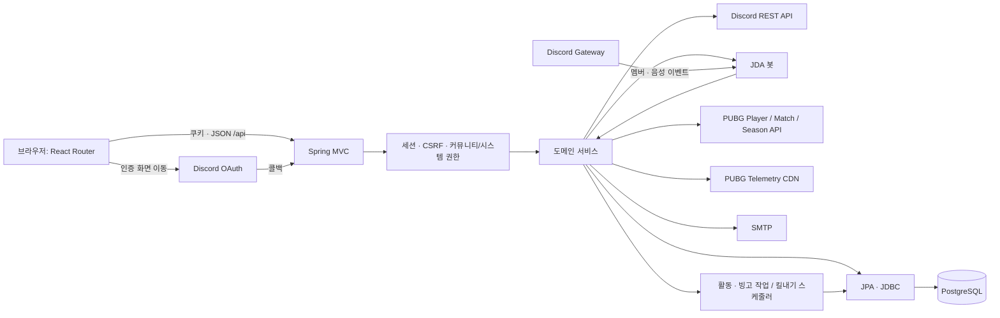
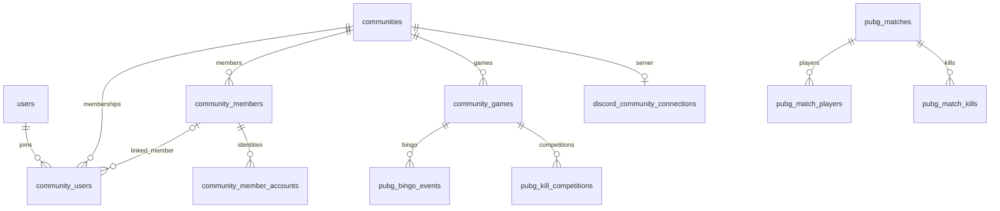
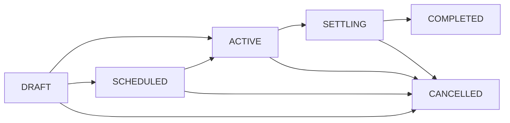
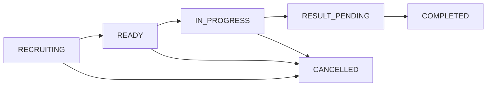

# GuildUp

Discord 기반 게임 커뮤니티 및 클랜 운영 관리 플랫폼.

이 문서는 **2026-10-10 작업 시점의 소스코드, 설정, 잠금 파일, 테스트**를 기준으로 작성했다. 운영 DB나 서버에 접속해 확인한 자료는 아니다. 현재 지원 게임은 **PUBG Kakao / Steam**이다.

## 목차

1. [프로젝트 소개](#1-프로젝트-소개)
2. [주요 기능](#2-주요-기능)
3. [기술 스택](#3-기술-스택)
4. [시스템 아키텍처](#4-시스템-아키텍처)
5. [프로젝트 디렉터리 구조](#5-프로젝트-디렉터리-구조)
6. [인증 및 권한 구조](#6-인증-및-권한-구조)
7. [데이터베이스 구조](#7-데이터베이스-구조)
8. [Discord 연동 구조](#8-discord-연동-구조)
9. [PUBG 연동 구조](#9-pubg-연동-구조)
10. [빙고 시스템](#10-빙고-시스템)
11. [킬내기 시스템](#11-킬내기-시스템)
12. [개발 환경 설정](#12-개발-환경-설정)
13. [빌드 및 배포](#13-빌드-및-배포)
14. [로깅 및 모니터링](#14-로깅-및-모니터링)
15. [테스트](#15-테스트)
16. [프로젝트 운영 시 주의사항](#16-프로젝트-운영-시-주의사항)

상세 문서: [개발 환경](docs/DEVELOPMENT.md) · [데이터 모델](docs/DATA_MODEL.md) · [PUBG·콘텐츠 집계](docs/PUBG_CONTENTS.md) · [운영·모니터링](docs/OPERATIONS.md) · [문서 검토 결과](docs/DOCUMENTATION_REVIEW.md).

## 1. 프로젝트 소개

GuildUp은 Discord 서버의 멤버 정보, 음성 활동, PUBG 경기 활동과 커뮤니티 이벤트를 웹에서 함께 관리하는 서비스다. 운영진은 역할에 따른 클랜원 동기화와 활동 확인, 팀 편성, 공지와 이벤트 운영을 수행하고, 회원은 출석·랭킹·빙고·킬내기에 참여한다.

Discord에 흩어진 운영 정보와 게임 기록을 커뮤니티 단위로 연결하는 것이 목적이다. 주요 사용자는 클랜 운영자와 운영진, 커뮤니티 회원이다. 이메일 가입과 초대 코드 가입도 지원하므로 Discord 연결 없이 커뮤니티를 생성하고 기본 기능을 사용할 수 있다. Discord 기능을 사용하려면 개인 계정 연결과 서버·봇 설정이 추가로 필요하다.

## 2. 주요 기능

| 기능 | 현재 구현된 역할 |
|---|---|
| 회원가입·로그인 | 이메일/비밀번호 가입·로그인, Discord 로그인, 기존 계정에 로그인 수단 추가, 로그아웃 |
| 계정·보안 | 닉네임·생년월일 관리, Discord 프로필 이미지 표시, 이메일 인증·재발송, 비밀번호 찾기·재설정, 본인 확인 후 회원탈퇴 |
| 커뮤니티 생성·가입 | 게임 선택, 생성자의 OWNER 등록, 생성 요청 중복 방지, 초대 코드 가입, Discord 서버 소속 기반 탐색·가입 |
| 회원·권한 관리 | 플랫폼 멤버십과 클랜원 구분, 클랜원 직접 등록·제거, Discord 역할 기반 동기화, OWNER의 ADMIN/MEMBER 지정 |
| Discord 서버·봇 | 관리 가능한 서버 OAuth 확인, 봇 설치 확인, 커뮤니티와 서버의 1:1 연결 |
| Discord 활동·DM | 음성 입장·이동·퇴장 기록, 기간별 누적·상세 조회, 운영진의 수신자 선택 DM과 개별 발송 결과 |
| PUBG 계정·활동 | Kakao/Steam별 닉네임·account ID 연결, 닉네임 추출 규칙, 같은 PUBG 팀에서 플레이한 클랜 활동과 경기 상세 |
| 팀 만들기 | 현재/이전 시즌 일반 스쿼드 통계의 평균 딜량을 이용한 운영진 팀 편성·재편성 |
| PUBG 빙고 | 공통 미션판과 회원별 진행도, Match/Telemetry 집계, 줄·전체 칸 완료 판정, 봇 전투 통계 제외, 개인·전체 집계 |
| PUBG 킬내기 | SOLO/DUO/SQUAD 대회, 신청·승인·팀 구성, 킬·순위 점수, 중간 집계와 지연 최종 발표 |
| 출석·랭킹 | 서울 날짜 기준 일일 출석, 출석·킬내기 우승 점수 원장, 월간·분기·전체 누적 랭킹 |
| 커뮤니티 소식·게시판 | 공지·일정 이벤트 CRUD와 대시보드 요약, 카테고리 게시글·댓글 관리 |
| 서비스 공지·가이드 | 전체 대상 공지·업데이트·점검 알림, 읽음·팝업 확인, 공개 서비스 소개·약관·개인정보·기능별 도움말 |
| 문의·건의 | 로그인 사용자의 공용 문의·건의·버그 신고, 본인 내역, SMTP 접수 알림, 시스템 관리자의 상태·답변 관리 |
| 관리자·모니터링 | SYSTEM_ADMIN 전용 커뮤니티·사용자·이벤트 조회, 전체 공지·문의 관리, 서버·DB 상태·이벤트·실시간 로그 |

이메일 인증 및 비밀번호 재설정은 코드에 구현되어 있지만 실제 메일 발송과 인증 강제 여부는 설정에 따른다. 다른 게임 지원, Discord 역할 부여·회수, 범용 서버 연결 해제 기능은 완료 기능으로 포함하지 않는다.

## 3. 기술 스택

프론트엔드 버전은 `package.json`의 범위와 `package-lock.json`의 확정 버전을 구분한다. 백엔드 관리 의존성은 Maven 해석 결과를 확인했다.

| 영역 | 기술 | 확인된 버전·설정 |
|---|---|---|
| Frontend | React / React DOM | 범위 `^19.1.1`, 잠금 버전 **19.2.8** |
| Frontend | React Router DOM | 범위 `^7.18.4`, 잠금 버전 **7.18.4** |
| Frontend | Vite / React 플러그인 | **7.3.6 / 5.2.0** (잠금 버전) |
| Frontend | JavaScript ESM, JSX, 자체 CSS | TypeScript·별도 UI 프레임워크 설정 없음 |
| Frontend 도구 | esbuild / jsdom | **0.28.2 / 30.1.1**; jsdom은 테스트용 |
| Backend | Java / Spring Boot | **21 / 4.1.1** |
| Backend | Spring Web MVC, Data JPA, Mail, Actuator | Spring Boot 4.1.1이 의존성 관리; Web MVC **7.0.9** |
| Backend | Spring Security Crypto | **7.1.1**, 비밀번호 해싱에 사용 |
| Backend | Hibernate ORM / JPA | **7.4.5.Final** / Jakarta Persistence |
| Backend | Discord JDA | **6.4.1** |
| Backend | Jackson | 기본 `tools.jackson` **3.1.5**; 런타임에 Jackson 2 **2.21.5**도 존재 |
| Build | Maven Wrapper | Maven **3.9.16**, wrapper **3.3.4** |
| Database | PostgreSQL JDBC | **42.7.13**; PostgreSQL 서버 버전은 저장소에서 확정 불가 |
| Test | JUnit / Mockito / H2 | **6.0.3 / 5.23.0 / 2.4.240** |
| Test | Spring Boot Test, MockMvc, Node test runner | H2 통합 테스트와 조건부 PostgreSQL 테스트 |
| Infrastructure | 정적 프론트엔드 + 실행 가능한 Spring Boot JAR | Ubuntu·Nginx·systemd의 실제 구성과 버전은 저장소에서 확인 불가 |

설정 기준: [pom.xml](pom.xml), [Maven Wrapper](.mvn/wrapper/maven-wrapper.properties), [package.json](frontend/package.json), [package-lock.json](frontend/package-lock.json), [Vite 설정](frontend/vite.config.js). Node 요구사항에는 테스트용 jsdom의 engine도 반영해야 한다. 상세 조건은 [개발 환경 문서](docs/DEVELOPMENT.md)에 있다.

## 4. 시스템 아키텍처


```mermaid
flowchart LR
    Browser[브라우저: React Router] -->|쿠키 · JSON /api| MVC[Spring MVC]
    Browser -->|인증 화면 이동| OAuth[Discord OAuth]
    OAuth -->|콜백| MVC
    MVC --> Guard[세션 · CSRF · 커뮤니티/시스템 권한]
    Guard --> Services[도메인 서비스]
    Services --> Persistence[JPA · JDBC]
    Persistence --> DB[(PostgreSQL)]
    Services --> REST[Discord REST API]
    Services --> JDA[JDA 봇]
    Gateway[Discord Gateway] -->|멤버 · 음성 이벤트| JDA
    JDA --> Services
    Services --> PUBG[PUBG Player / Match / Season API]
    Services --> Telemetry[PUBG Telemetry CDN]
    Services --> SMTP[SMTP]
    Services --> Jobs[활동 · 빙고 작업 / 킬내기 스케줄러]
    Jobs --> Persistence
```

로컬에서는 Vite가 `:5173`에서 React를 제공하고 `/api`를 `:8080` 백엔드로 프록시한다. 백엔드는 세션 사용자 상태, 권한, 상태 변경 요청의 CSRF를 검사한 뒤 서비스를 실행한다. PUBG 활동·빙고는 별도 실행기에서 처리하고 진행 상태를 조회하며, 킬내기 최종 발표는 DB에 저장한 발표 시각을 스케줄러가 확인한다.

Discord OAuth REST 호출과 JDA 봇의 Gateway 연결은 별개다. OAuth는 개인 식별·서버 관리 권한 확인에, JDA는 봇 설치 확인·멤버 조회·음성 이벤트·DM에 사용한다. SMTP는 문의 알림과 인증·비밀번호 재설정 메일에 사용한다.

프론트엔드 빌드는 백엔드 JAR에 자동 포함되지 않는다. `src/main/resources/static/`의 이전 UI와 `frontend/src/`의 React UI가 함께 존재하므로 현재 UI를 제공할 정적 호스팅 경로를 구분해야 한다.

## 5. 프로젝트 디렉터리 구조

```text
.
├── pom.xml, mvnw, mvnw.cmd          # Java 21 / Maven 빌드
├── src/main/java/com/guildup/
│   ├── user/                       # 로그인, 계정, 탈퇴, 이메일 인증, 재설정
│   ├── account/                    # 외부 계정 provider 정의
│   ├── community/                  # 커뮤니티·회원·활동·팀 편성·게시판·점수
│   ├── discord/                    # OAuth, 봇, 역할·멤버·DM·음성 기록
│   ├── pubg/                       # API·캐시·요청 제한·영속 경기 Fact
│   ├── bingo/, killcompetition/     # PUBG 콘텐츠와 집계
│   ├── announcement/, feedback/     # 서비스 공지와 공용 고객지원
│   ├── developer/, monitoring/      # 시스템 관리 조회·이벤트·로그
│   └── mail/                       # 공통 SMTP 설정·메일 템플릿
├── src/main/resources/
│   ├── application*.properties      # 공통/local/prod 설정
│   ├── logback-spring.xml           # 로그 마스킹·파일 회전
│   ├── db/manual/                  # 수동 DDL·보정·감사 SQL
│   └── static/                     # 이전 정적 HTML/JS/CSS
├── src/test/                       # 단위·H2 통합·조건부 PostgreSQL 테스트
├── frontend/
│   ├── src/pages/, components/      # React 화면과 공통 UI
│   ├── src/api/                    # 세션·CSRF 요청, 진단·취소 처리
│   ├── src/community/, announcement/ # Context와 게임 범위 관리
│   ├── src/developer/, styles/       # 관리자 화면·스타일
│   ├── test/                       # Node test runner 테스트
│   └── scripts/                    # 정적 진입 파일 생성·빌드 검증
├── scripts/                        # 특수 빙고 baseline·PG 관찰 스크립트
├── docs/                           # 현재 기준 상세 문서와 기존 보관 자료
└── *.md                            # 기능별 기존 구현·검토 보고서
```

백엔드는 기능별 패키지 안에 `controller → service → repository/domain`을 둔다. 모든 기능이 같은 계층 구성인 것은 아니며 인증·메일 토큰 모듈은 자체 패키지에 모여 있다. 신규 구현 위치는 React의 `frontend/src/`와 해당 Java 도메인 패키지를 우선 확인한다. `target/`, `frontend/dist/`, `logs/`는 생성 결과다.

## 6. 인증 및 권한 구조

### 로그인과 계정

- 이메일은 앞뒤 공백 제거·소문자 정규화 후 저장한다. 비밀번호는 영문·숫자를 포함한 8자 이상, UTF-8 72바이트 이하이며 기본 `{bcrypt}` 해시로 저장한다. 가입 성공 시 세션 로그인한다.
- Discord 개인 로그인은 `/api/auth/discord/authorize`에서 시작해 `/api/auth/discord/callback`으로 돌아온다. 기존 외부 계정으로 사용자를 찾거나 새 사용자를 만든다. 로그인 범위는 `identify`다.
- 이메일 사용자에게 Discord를 연결하거나 Discord 사용자에게 이메일 로그인 수단을 추가할 수 있다. 다른 사용자에게 연결된 Discord 계정은 중복 연결할 수 없다. 이메일 문자열이 같다는 이유로 계정을 자동 병합하지 않는다.
- 개인 Discord 연결 해제는 이메일 로그인 수단이 있어야 가능하다. 개인 연결을 해제하는 API와 커뮤니티의 Discord 서버 연결은 서로 다른 데이터다.
- 프로필에서 닉네임·생년월일을 수정한다. Discord 아바타는 연결된 외부 계정 정보에서 가져오며, 이미지 업로드 기능으로 설명하지 않는다.
- 이메일 인증 전에도 로그인은 가능하다. `EMAIL_VERIFICATION_ENFORCE_NEW_USERS`가 켜지고 인증 필요 표시가 있는 미인증 이메일 계정이며 Discord 연결이 없으면 커뮤니티 관련 기능을 제한한다.
- 이메일 인증·재설정 토큰은 용도를 구분해 해시·유효기간·사용/무효화 상태를 DB에 저장한다. 비밀번호 재설정 시 인증 버전이 증가하고 기존 로그인 세션을 무효화한다.

### 세션과 로그인 보안

JWT 기반 인증이 아니라 **Servlet `HttpSession`**을 사용한다. `LOGIN_USER_ID`와 인증 버전을 세션에 저장하며 로그인 시 세션 ID와 CSRF 토큰을 교체한다. 상태 변경 API는 `/api/auth/csrf`에서 받은 토큰을 `X-CSRF-Token`으로 보낸다. 공통 React API 함수가 이를 처리하며 회원가입·로그인·재설정 요청도 보호한다.

쿠키는 `HttpOnly`, `SameSite=Lax`, 경로 `/`, cookie-only 추적이다. `Secure`는 공통 설정 기본 false, `prod` 프로필 기본 true다. 세션 만료 시간은 프로젝트가 별도로 지정하지 않는다. 세션 및 OAuth 임시 상태의 공유 저장소 설정은 없다.

로그인 실패는 계정별 지연, IP별 요청 제한, 여러 계정을 시도하는 공격 탐지, 동시 비밀번호 검증 제한으로 제어한다. 식별자는 HMAC 처리한다. 프록시 헤더는 설정한 신뢰 프록시에서만 처리하며 `server.forward-headers-strategy=none`을 사용한다.

### 권한의 세 가지 범위

| 범위 | 코드의 권한 | 의미 |
|---|---|---|
| 플랫폼 일반 사용자 | `User.systemRole = USER` | 활성 세션으로 본인 계정·내 커뮤니티·문의 등에 접근 |
| 커뮤니티 회원 | `CommunityUser.role = MEMBER` | 해당 커뮤니티 기본 조회·출석·게임 콘텐츠 참여; 킬내기 생성 및 본인이 만든 대회 관리 가능 |
| 커뮤니티 운영진 | `ADMIN`, `OWNER` | Discord 관리, 활동·팀 만들기, 공지·이벤트, 빙고 생성·전체 집계 등 |
| 커뮤니티 소유자 | `OWNER` | ADMIN/MEMBER 역할 지정, 커뮤니티 삭제; OWNER 위임 API는 없음 |
| 시스템 관리자 | `User.systemRole = SYSTEM_ADMIN` | `/api/developer/**`의 전체 조회·공지·문의·모니터링 관리 |

Discord의 서버 소유권·`ADMINISTRATOR`·`MANAGE_GUILD`는 서버 연결 OAuth 검증에 쓰인다. 이를 GuildUp의 ADMIN/OWNER/SYSTEM_ADMIN으로 자동 변환하지 않는다. SYSTEM_ADMIN 역시 일반 커뮤니티 API에서 멤버십 검사를 자동 우회하지 않는다. 프론트엔드 메뉴 숨김 외에 인터셉터와 서비스가 서버에서 접근을 검사한다.

### 회원탈퇴

OWNER 커뮤니티가 있으면 탈퇴를 차단한다. 현재 비밀번호 또는 이메일 로그인 수단이 없는 사용자의 연결된 Discord 재인증과 최종 동의를 확인한다. 사용자는 `WITHDRAWN` 상태·익명 프로필로 남고 인증 수단·공지 읽음 기록을 제거하며 멤버십을 종료한다. 클랜원·외부 계정·음성 식별자는 익명화하고, 경기·빙고·킬내기·점수 이력을 일괄 삭제하거나 재정산하지 않는다. 문의 본문이나 기존 로그의 모든 개인정보가 자동 삭제된다고 보장하지 않는다.

## 7. 데이터베이스 구조

운영 DB 대신 Entity, Repository/JDBC 및 수동 SQL로 모델을 확인했다. 핵심은 **플랫폼 사용자, 커뮤니티 멤버십, 실제 클랜원, 게임 계정을 분리**하는 것이다.

| 데이터 묶음 | 주요 테이블과 관계 |
|---|---|
| 사용자·인증 | `users` → `user_credentials`(선택적 1:1), `user_external_accounts`(1:N); 이메일 인증·재설정 토큰은 credential 참조 |
| 커뮤니티·게임 | `communities` → `community_games`; 게임마다 활동 규칙·동기화 상태, 빙고·킬내기 범위를 구분 |
| 멤버십·클랜원 | `community_users`가 사용자·커뮤니티·역할을 연결하고 선택적으로 `community_members`를 참조; Discord에서 수집된 클랜원이 플랫폼 사용자라는 의미는 아님 |
| 외부 계정·Discord | `community_member_accounts`에 Discord/PUBG 식별자; `discord_community_connections`는 서버 1:1 연결, 역할 설정·음성 세션은 별도 저장 |
| PUBG 경기 | `pubg_matches` → `pubg_match_players`, `pubg_match_kills`; `(shard, match_id)`로 플랫폼별 경기 원본 요약·Fact 식별 |
| 활동 | `community_member_activity_snapshots` → 경기·팀원 스냅샷; 게임별 최신 동기화 결과 |
| 빙고 | `pubg_bingo_events` → 칸·참가자 → 진행도·완료 줄; 처리 경기·내부 콘텐츠·미수집 경기 기록 |
| 킬내기 | `pubg_kill_competitions` → 참가자·팀·참가자별 경기 결과; 최종 정산 claim·발표 시각을 대회에 저장 |
| 출석·랭킹 | `community_attendances`, `community_score_history`, `community_member_scores`; 별도 랭킹 테이블 대신 원장·총점으로 조회 |
| 소식·게시판 | `community_notices`, `community_events`, `community_posts`, `community_post_comments` |
| 서비스 공지·지원·모니터링 | `platform_announcements`, `platform_announcement_reads`, `feedbacks`, `monitoring_events`; 관리자 전용 사용자 테이블은 없음 |


```mermaid
erDiagram
    users ||--o{ community_users : joins
    communities ||--o{ community_users : memberships
    communities ||--o{ community_members : members
    community_members o|--o{ community_users : linked_member
    community_members ||--o{ community_member_accounts : identities
    communities ||--o{ community_games : games
    communities ||--o| discord_community_connections : server
    community_games ||--o{ pubg_bingo_events : bingo
    community_games ||--o{ pubg_kill_competitions : competitions
    pubg_matches ||--o{ pubg_match_players : players
    pubg_matches ||--o{ pubg_match_kills : kills
```

ER은 핵심 FK 관계의 일부다. PUBG 원본 경기와 콘텐츠별 처리 기록은 shard/account ID/match ID를 통해 계산 단계에서 연결하며 모두 직접 FK로 연결된 구조는 아니다. 전체 데이터 묶음, unique 제약과 보존 경계는 [데이터 모델](docs/DATA_MODEL.md)을 참고한다.

## 8. Discord 연동 구조

1. **개인 계정 인증**: `/api/auth/discord/*`는 로그인·계정 연결·탈퇴 확인용이다. OAuth 목적과 사용자, 일회성 state를 세션에 묶는다.
2. **서버 연결 인증**: `/api/community-creation/discord/oauth/authorize` 또는 `/api/communities/{communityId}/discord/oauth/authorize`는 `identify guilds` 범위로 서버 목록을 확인한다. 소유자 또는 `ADMINISTRATOR`/`MANAGE_GUILD` 보유 서버만 선택 가능하다. 공통 콜백은 `/api/discord/oauth/callback`이다.
3. **봇 설치 확인**: OAuth 결과의 선택 서버를 검증하고 설치 URL을 제공한다. 설치 후 JDA에서 해당 guild를 확인해 커뮤니티와 연결한다. 서버와 커뮤니티는 1:1이고 기존 연결을 다른 서버로 교체하지 못한다.
4. **클랜원 관리**: 운영진이 클랜원 판별 역할을 설정한다. 전체 동기화와 Gateway 가입·탈퇴·역할·닉네임 변경, 시작 시 재확인 작업으로 상태를 반영한다. 역할 설정은 클랜원 판별용이며 Discord 역할 자체를 부여·수정하는 기능은 없다.
5. **음성 기록**: 봇 사용자를 제외하고 연결된 서버의 음성 입장·이동·퇴장을 `discord_voice_sessions`에 기록한다. 운영진은 서울 기준 전체·일·월요일 시작 주·월·년과 과거 기준 날짜로 목록/상세를 조회한다. 기간 경계에 걸친 세션은 겹치는 시간만 계산한다.
6. **DM**: 실제 서버 멤버인 수신자를 확인해 순차 발송한다. 중복 요청 제한 기본 10초, 수신자별 성공·차단·API 오류 결과를 반환한다.

JDA는 `GUILD_MEMBERS`, `GUILD_VOICE_STATES` intent와 음성 캐시를 사용한다. 전체 멤버를 시작 시 적재하지 않고 온디맨드 조회하며 멤버 snapshot 캐시는 30초다. Discord Developer Portal의 Server Members Intent 활성화와 실제 봇 권한을 확인해야 한다.

서버 OAuth state 10분·결과 5분·봇 설치 토큰 10분은 프로세스 메모리에 있다. access token은 API 호출 중 사용하고 DB에 저장하지 않는다. state 불일치·만료·서버 중복 연결·봇 미설치·멤버 조회 실패를 예외로 처리한다.

개인 Discord 연결 해제는 지원하지만 **서버 연결만 해제하는 범용 API는 없다**. 음성 복구는 재시작 시 열린 기록과 현재 접속자를 맞추므로 다운타임 중의 실제 이동·퇴장 시각을 복원하지 못한다.

## 9. PUBG 연동 구조

게임 경로는 `/api/communities/{communityId}/games/{communityGameId}/…`다. `CommunityGame`의 소속과 기능 지원 여부를 검사하므로 클라이언트가 임의 game ID로 다른 커뮤니티 데이터에 접근할 수 없다.

| 게임 | 계정 platform | API shard |
|---|---|---|
| `BATTLEGROUNDS_KAKAO` | `KAKAO` | `kakao` |
| `BATTLEGROUNDS_STEAM` | `STEAM` | `steam` |

사용자는 게임별 본인 PUBG 닉네임을 등록하거나 운영진이 Discord 닉네임 추출 규칙으로 연결한다. Player API로 해당 플랫폼의 존재하는 account ID를 확인하지만 **게임 계정 소유권 OAuth 인증은 아니다**. 같은 커뮤니티·플랫폼에서 이미 다른 클랜원에게 연결한 계정은 중복 등록할 수 없다.

Player API는 이름/ID를 10명 단위로 조회하고 최근 match ID를 모은다. Match API는 경기 시작 시각·팀·참가자·킬·순위·Telemetry asset 등을 읽는다. Season API는 팀 만들기용 통계에 사용한다.

| 소비 기능 | 데이터 활용·저장 |
|---|---|
| 클랜 활동 | Player/Match 조회 → 활동 기간·같은 roster의 클랜원 수 판정 → 게임별 활동/경기/팀원 스냅샷 저장; 기본 최근 14일·본인 포함 2명 |
| 빙고 | Player/Match 수집 → 영속 경기 요약·Telemetry Fact 저장 → 미션 계산과 처리 이력 저장 |
| 킬내기 | fresh Player/Match 조회 → 기간·참가 자격 시작 시각 필터 → 대회별 참가자 경기 결과 저장; Telemetry를 사용하지 않음 |
| 팀 만들기 | 현재·이전 시즌 일반 스쿼드 평균 딜량 → 팀 편성; 빙고 Fact로 계산하지 않음 |

Player/Match 캐시와 중복 동시 요청 제어는 공유한다. Player 캐시 1분, Match 성공 24시간·미존재 1분, Telemetry 파싱 Fact 캐시 30분이다. 캐시 키에도 shard/platform이 포함된다.

Player/Season 계열 요청은 기본 최소 250ms 간격과 Rate Limit 헤더에 맞춰 제어한다. **Match 요청은 이 governor를 우회**하고 별도 동시성 제한(기본 3)을 사용한다. API 클라이언트는 429, 일부 5xx, 네트워크 접근 오류에 최대 4회 시도한다. Telemetry는 공식 CDN URL만 호출하고 즉시 자동 재시도하지 않으며 다음 집계에서 미수집 데이터를 다시 시도한다. 상세 제한·실패·중복 방지 흐름은 [PUBG·콘텐츠 문서](docs/PUBG_CONTENTS.md)에 있다.

## 10. 빙고 시스템

운영진이 게임별 이벤트를 생성한다. 3×3·4×4·5×5 공통 미션판, 목표 줄 수, 전체 칸 완료 표시(blackout), 늦은 참가 허용, 봇 전투 통계 제외, 클랜 동반 플레이 조건과 기간을 설정한다. 각 회원에게 같은 칸의 개별 진행도와 완료 줄이 저장된다.

**별도 참가 신청 API는 없다.** 시작 시점 이전 가입 회원을 자동 등록하고, 늦은 가입 허용 시 해당 회원을 추가 등록한다. PUBG 계정이 없는 참가자는 등록될 수 있지만 PUBG 미션 집계에는 계정 연결이 필요하다. 늦은 참가자의 인정 시작 시각은 참가 등록 시점이다.

미션은 킬·딜량·기절·헤드샷·무기·장거리·생존·이동·아이템·클랜 동반 플레이 등의 PUBG 미션과 GuildUp 킬내기 승리 미션으로 나뉜다. 기간 누적(`EVENT_TOTAL`), 한 경기 조건(`SINGLE_MATCH`), 조건 달성 경기 수(`MATCH_OCCURRENCES`)를 지원한다. 가로·세로·양 대각선으로 줄을 계산하고 목표 줄 달성 및 blackout 시각을 별도로 기록한다.


```mermaid
flowchart LR
    DRAFT --> SCHEDULED --> ACTIVE --> SETTLING --> COMPLETED
    DRAFT --> ACTIVE
    DRAFT --> CANCELLED
    SCHEDULED --> CANCELLED
    ACTIVE --> CANCELLED
    SETTLING --> CANCELLED
```

현재 구현은 **일반전·경쟁전으로 명확히 분류된 경기만** PUBG 미션에 인정한다. 종료 입력 분 전체를 포함하며, 예를 들어 종료가 22:00이면 경기 시작 시각은 22:01 미만까지 인정한다. 그 상한에서 30분이 지난 뒤 전체 데이터 수집과 재계산이 성공해야 `COMPLETED`로 확정한다. 시간 경과만으로 최종 결과를 자동 확정하지 않는다.

전체 집계는 운영진이, 내 기록 집계는 본인이 요청한다. HTTP 202 접수 후 상태 API를 조회하며 30분 재집계 제한과 실행 중 요청 제어가 있다. 준비·외부 API 수집·DB 계산을 분리하고 이벤트/참가자 잠금·버전 검증·처리 이력으로 중복과 오래된 결과 반영을 막는다. 수집이 불완전하면 최종 확정을 보류하고 기존 진행도를 보존하는 경로를 사용한다.

봇 전투 통계 제외는 AI bot 피해자/대상과 관련된 킬·딜량·기절·헤드샷 및 세부 킬 조건에 적용한다. 모든 경기나 모든 통계를 제거하는 옵션은 아니다. 해당 계산에는 최신 Telemetry Fact가 필요하다.

확정 킬내기 우승은 같은 게임의 `KILL_BET_WIN` 미션에 반영하며 대회 종료 시각을 기준으로 판단한다. 해당 대회 삭제 시 연결한 승리 진행도도 되돌린다. 별도의 **임시 재집계 미리보기·적용 도구**가 코드에 남아 있으므로 일반 집계와 구분해야 한다.

## 11. 킬내기 시스템

활성 커뮤니티 회원이 SOLO·DUO·SQUAD 대회를 생성한다. 모집 중 신청은 승인 상태로 등록하고 진행 중 신청은 승인 대기로 등록한다. 대회 생성자 또는 OWNER/ADMIN이 참가 신청 승인·거절, 직접 참가자 추가, 모집 개폐·종료, 팀 구성·이동, 시작·종료·종료 시각·점수 설정 변경·취소·삭제를 상태 조건에 따라 수행한다. 승인된 참가자와 게임 플랫폼의 PUBG account ID를 기준으로 집계하며 도중 승인된 참가자의 `eligibleFrom` 이전 경기는 제외한다.


```mermaid
flowchart LR
    RECRUITING --> READY --> IN_PROGRESS --> RESULT_PENDING --> COMPLETED
    RECRUITING --> CANCELLED
    READY --> CANCELLED
    IN_PROGRESS --> CANCELLED
```

점수 계산의 기준은 `KillCompetitionScoring`과 기존 테스트다. **대회 점수와 커뮤니티 랭킹 보상은 서로 다른 점수**다.

| 점수 | 계산 |
|---|---|
| SOLO 개인 경기 점수 | `킬 수 × killPoint + 해당 경기 순위 점수` |
| DUO/SQUAD 개인 경기 점수 | `킬 수 × killPoint` (개인에게 순위 점수를 더하지 않음) |
| 팀 경기 점수 | `해당 경기의 승인된 팀원 킬 합 × killPoint + 팀 순위 점수 1회` |
| 개인/팀 누적 점수 | 인정 경기별 점수 합; 팀 누적은 개인 기본 점수 합과 팀 경기별 순위 보너스 합 |

기본 `killPoint=1`, 순위 점수 기능은 꺼져 있다. 켜면 기본 1위 5점·2위 4점·3위 3점·4~5위 각 2점·6~10위 각 1점이며 1~10위별 설정을 지원한다. 같은 팀·match ID의 순위가 다르면 유효한 가장 높은 등수(최소 양수)를 한 번 사용한다. 팀원 수만큼 순위 보너스를 지급하지 않는다. 총점 동점은 공동 등수로 표시한다.

중간 집계는 진행 중에 요청하며 마지막 성공 후 5분 제한이 있다. 인정 범위는 경기 **시작 시각** 기준 `[max(대회 시작, 참가 자격 시작), 집계 시각 또는 종료 시각)`이다. 결과 발표 요청은 종료 후 `RESULT_PENDING`으로 전환하고 **요청 시각부터 30분 뒤** 발표 대상으로 만든다. 스케줄러는 기본 60초 간격으로 확인한다.

정산 claim을 짧은 DB 트랜잭션에서 획득하고 외부 API 호출 후 결과·보상·완료 상태를 함께 확정한다. 최종 claim은 UUID와 10분 유효 조건으로 보호한다. Player/Match 응답이 불완전하면 정산을 중단하며 실패를 기록하고 발표 대기 상태에서 재시도한다. `(대회, 참가자, match ID)` 결과를 합쳐 중복 집계를 방지하고 이전에 저장한 경기 결과를 보존한다.

승인 참가자 4명 이상 대회의 실제 경기 기록이 있는 우승자는 커뮤니티 보상 **3점**, 서울 날짜 기준 회원당 하루 한 번을 받을 수 있다. 팀전은 우승 팀의 인정 대상 회원에게 적용한다. 이 보상 조건과 빙고의 킬내기 승리 반영은 별도 로직이다. 예제와 예외 조건은 [상세 문서](docs/PUBG_CONTENTS.md)를 참고한다.

## 12. 개발 환경 설정

사전 준비: Git, JDK 21, Node.js/npm, **개발 전용 PostgreSQL**, 개발용 Discord Application/봇, PUBG API 키. Maven은 wrapper를 사용한다. JDA bean이 시작하면서 실제 로그인하고 `awaitReady()`하므로 현재 백엔드에 봇 없이 실행하는 전용 프로필은 없다.

```bash
git clone https://github.com/heun0180/guildup.git
cd guildup
```

이미 받은 저장소에서는 해당 루트에서 실행한다. [개발 환경 문서](docs/DEVELOPMENT.md)의 안전한 환경변수 예시를 개발용 값으로 설정하고 PostgreSQL을 준비한다. **공통 설정의 DB 접속 정보를 그대로 사용하지 말고 `SPRING_DATASOURCE_URL/USERNAME/PASSWORD`로 로컬 DB를 명시한다.** `.env`는 Spring Boot/Vite가 이 백엔드 설정에 자동 로드하는 파일이 아니다.

```bash
# 터미널 1: 환경변수 설정 후 저장소 루트
./mvnw spring-boot:run -Dspring-boot.run.profiles=local
```

```bash
# 터미널 2: 저장소 루트
cd frontend
npm ci
npm run dev
```

| 주소 | 용도 |
|---|---|
| `http://localhost:5173` | 현재 React UI |
| `http://localhost:5173/login.html` | 로그인·회원가입 |
| `http://localhost:8080` | Spring Boot, 직접 접근 시 이전 정적 UI가 보일 수 있음 |
| `http://localhost:5173/api/auth/discord/callback` | 개인 Discord 로그인·연결 콜백 |
| `http://localhost:5173/api/discord/oauth/callback` | 서버 연결 OAuth 콜백 |

개발 Discord Application에 두 callback URL을 등록한다. `DISCORD_REDIRECT_URI`는 서버 연결 콜백에 사용하고 개인 콜백은 현재 요청의 host/protocol에서 생성한다. Vite는 `changeOrigin:false`로 host를 유지한다. 항상 같은 브라우저 origin에서 로그인과 API를 사용한다. 커뮤니티 화면은 `communityId`, 게임 화면은 선택한 `communityGameId` 범위를 함께 사용한다.

## 13. 빌드 및 배포

```bash
# 저장소 루트: 15절의 일반 테스트를 수행한 뒤 패키징
./mvnw -DskipTests package
```

```bash
cd frontend
npm ci
npm run build
npm run verify:build
```

산출물은 `target/guildup-backend-0.0.1-SNAPSHOT.jar`와 `frontend/dist/`다. 프론트엔드 빌드는 React Router의 `.html` 및 고정된 확장자 없는 경로에 진입 HTML을 생성하고 참조 JS 자산을 검증한다. 동적 `/developer/communities/:communityId/...` 경로는 정적 파일로 생성되지 않아 호스팅 측 SPA fallback이 필요하다.

로컬 패키지 실행은 개발 환경변수 설정 후 다음과 같다.

```bash
java -jar target/guildup-backend-0.0.1-SNAPSHOT.jar --spring.profiles.active=local
```

운영용 `prod` 프로필은 Secure cookie와 인증 메일 URL의 HTTPS 조건을 강화한다. **DB의 `ddl-auto=update`를 덮어쓰는 운영 전용 설정은 없다.** 배포 전에 수동 SQL·데이터 보정·프로필 적용 내용을 검토해야 한다.

저장소에는 Nginx 설정, systemd unit, Docker/Compose, CI/CD 및 일반 배포 스크립트가 없다. 따라서 Ubuntu 버전, 실제 정적 root·proxy 설정, service 이름, 환경변수 파일, 서버 재시작·배포 상태 확인 명령을 확정할 수 없다. `scripts/`의 빙고 baseline 스크립트는 배포 도구가 아니다.

확인 가능한 운영 구성 요구사항은 React 산출물 전체 제공, `/api` 백엔드 연결, SPA 동적 경로 처리, OAuth host/protocol 보존과 신뢰 프록시 설정, HTTPS, 독립적인 JAR·프론트엔드 배포다. 실제 배포 절차를 확보하기 전 임의의 `systemctl`·SSH·SQL 명령을 운영에 적용하지 않는다. [운영 문서](docs/OPERATIONS.md)에 확인 범위를 정리했다.

## 14. 로깅 및 모니터링

| 계층 | 구현 |
|---|---|
| 애플리케이션 로그 | 콘솔 + `logs/guildup.log` (또는 `LOG_PATH`), 날짜/100MB 단위 압축 회전, 최대 30일·총 5GB |
| 요청·오류 | `X-Request-ID`, MDC의 requestId/userId/communityId 및 작업·단계; 공통 예외/HTTP 5xx 기록과 안전한 사용자 응답 |
| 로그인 보안 | 실패·제한·공격 징후를 SECURITY 이벤트로 기록; 원문 이메일·IP 대신 HMAC 식별자 사용 |
| PUBG·집계 | API 제한·재시도·실패, 활동 sync 단계·소요시간, 빙고 진행·실패·지연, 킬내기 중간·최종 오류 |
| 이벤트 DB | `monitoring_events`; 기본 비동기 별도 저장, 보관 기간 기본 30일, 배치 정리 |
| 관리자 화면 | `/developer/monitoring`: CPU·메모리·디스크·uptime, DB 연결, 최근 24시간 오류 통계, 이벤트 필터·상세, 실시간 로그 |
| 실시간 로그 | 메모리 ring buffer 기본 1,000개, SYSTEM_ADMIN 전용 SSE, 재연결 ID·권한/세션 재검사 |

Logback과 이벤트 sanitizer는 비밀번호·토큰·쿠키·Authorization·이메일·SQL/응답 본문 등을 마스킹·길이 제한한다. 프론트엔드 API 오류는 요청 ID와 안전한 진단 정보를 표시한다. 모든 자유 입력·기존 파일·외부 시스템 로그의 개인정보가 제거된다는 보장은 없으므로 별도 검토가 필요하다.

Actuator는 의존성에 포함되어 있지만 HTTP endpoint는 `management.endpoints.web.exposure.exclude=*`로 비공개다. `/actuator/health`를 공개 상태 확인 API로 안내하지 않는다. 파일 로그의 임의 다운로드·삭제 API나 외부 알림/중앙 로그 수집 시스템은 확인되지 않는다. SSE는 보관 파일 전체를 읽는 로그 뷰어가 아니다.

## 15. 테스트

개발 환경변수를 설정한 뒤 테스트 전용 절차로 실행한다. 특히 `SPRING_DATASOURCE_URL`은 특수 baseline 테스트를 활성화하므로 일반 테스트에서 제거한다.

```bash
# 저장소 루트: PostgreSQL/덤프 조건부 테스트 비활성화
(
  unset SPRING_DATASOURCE_URL TEST_POSTGRES_URL TEST_POSTGRES_USER TEST_POSTGRES_PASSWORD
  unset SPRING_PROFILES_ACTIVE
  export EMAIL_VERIFICATION_MAIL_ENABLED=false PASSWORD_RESET_MAIL_ENABLED=false
  export EMAIL_VERIFICATION_URL='https://example.invalid/email-verification.html'
  export PASSWORD_RESET_URL='https://example.invalid/password-reset.html'
  ./mvnw test
)
```

```bash
cd frontend
npm test
```

백엔드는 도메인 계산·API 권한·세션/CSRF·인증/탈퇴/메일 토큰·Discord·PUBG 캐시/저장·활동·점수·빙고 동시성·킬내기 정산·공지·문의·모니터링을 검증한다. 통합 테스트는 주로 `@SpringBootTest` + MockMvc + H2 `create-drop`이며 외부 JDA/PUBG/SMTP 호출을 mock한다. 프론트엔드는 Node test runner와 jsdom으로 계산·요청 처리·화면/라우팅·빌드 계약을 검증한다.

2026-10-10 검증 결과:

| 검증 | 결과 |
|---|---|
| `./mvnw test` | 총 1,235개, **940개 통과**, 실패·오류 0, 조건부 295개 skipped |
| `npm test` | **241개 통과**, 실패 0 |
| `./mvnw -DskipTests package` | 성공, 실행 가능한 JAR 생성; 앱 실행 없음 |
| `npm run build` 및 내부 검증 | 성공, 46개 정적 route entry 확인; JS 번들 500kB 초과 경고 |
| Maven 의존성 해석 | 성공; 스택 버전 표에 반영 |

PostgreSQL 테스트는 `TEST_POSTGRES_URL`을 설정할 때만 실행하며 `create-drop`, 테이블/스키마 삭제 등 파괴적 초기화를 포함한다. **폐기 가능한 테스트 전용 DB만 사용한다.** `BingoProductionDumpBaselineTests`는 별도 로컬 복원 DB와 실제 PUBG 호출 가능성이 있는 특수 하네스로 이번에 실행하지 않았다. 실제 운영 배포·외부 API 정상 동작까지 검증한 결과는 아니다. 상세 결과는 [검토 보고서](docs/DOCUMENTATION_REVIEW.md)에 있다.

## 16. 프로젝트 운영 시 주의사항

- **DB 보호**: 앱 실행 자체가 `ddl-auto=update` 및 startup migration으로 스키마·데이터를 변경할 수 있다. 로컬·테스트·운영 DB URL을 명시적으로 구분한다. 문서 확인을 위해 운영 앱을 실행하거나 SQL을 적용하지 않는다.
- **스키마 관리**: Flyway/Liquibase는 없다. `src/main/resources/db/manual/`의 DDL·backfill·audit·특정 이벤트 보정 SQL을 구분하고 기존 스키마·적용 이력을 확인한다. 파일 전체를 이름순 일괄 실행하지 않는다.
- **플랫폼 경계**: Kakao/Steam은 다른 account/match namespace다. 플랫폼 추가·보정에서는 audit → backfill → 제약 강화의 각 SQL을 검토하고 게임이 둘 이상인 커뮤니티를 임의로 한 게임에 연결하지 않는다.
- **중복·재시도**: 처리 경기·내부 콘텐츠 기록, 점수 원장, 정산 claim을 임의로 지우면 중복 지급·진행도 변동이 생길 수 있다. 빙고 수집 실패와 킬내기 발표 대기 오류는 완료 상태와 구분한다.
- **외부 API**: Player의 최근 경기 목록이 무제한 전체 이력은 아니다. Rate Limit·반영 지연·404·Telemetry 누락을 고려하고 캐시 우회/재집계가 호출량을 늘린다는 점을 확인한다.
- **Discord**: intent·guild 접근·역할 설정·서버 관리 권한을 구분한다. 음성 기록은 수집 시작 이후 데이터이며 다운타임 기록은 정확히 복원되지 않는다.
- **민감정보**: 실제 키·OAuth secret·DB 정보·SMTP 정보·개인키를 문서/로그/커밋에 넣지 않는다. 공통 설정의 DB literal은 환경변수로 덮어쓰고 인증·문의 메일 수신처도 개발용으로 지정한다.
- **탈퇴·보존**: 계정 탈퇴, 클랜원 제거, 커뮤니티 삭제는 서로 다른 동작이다. 익명화 후 보존하는 집계 이력과 문의/로그의 잔존 데이터를 구분한다. 법적 보존 기간을 코드에서 추정하지 않는다.
- **프로세스 메모리**: 세션·OAuth 결과·요청 제한·캐시·빙고 작업 상태·일부 잠금은 인스턴스별이다. 다중 인스턴스/재시작 시 공유 동작이 보장된다고 가정하지 않는다.
- **화면 제공**: React 빌드와 이전 Spring 정적 UI의 동일 URL 충돌, 동적 route fallback, 신뢰 프록시·Secure cookie 적용을 실제 호스팅 설정에서 확인한다.
- **문서 추적**: 현재 `.gitignore`가 `docs/` 전체를 제외한다. 새 기준 문서를 공유할 때 [검토 보고서의 지정 파일 추적 절차](docs/DOCUMENTATION_REVIEW.md)를 적용해야 한다. 기존 루트 보고서와 `docs/guildup-docs-backup/`은 현재 기준 문서와 구분한다.

확인되지 않은 운영 구성, 기존 README와의 차이, 기술 부채와 후속 문서화 제안은 [문서 검토 결과](docs/DOCUMENTATION_REVIEW.md)에 기록했다.
