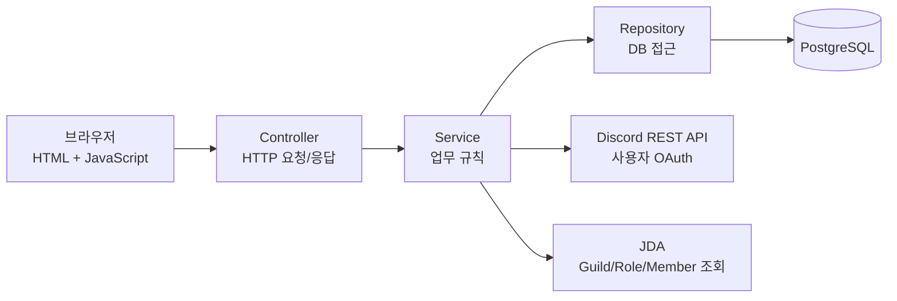
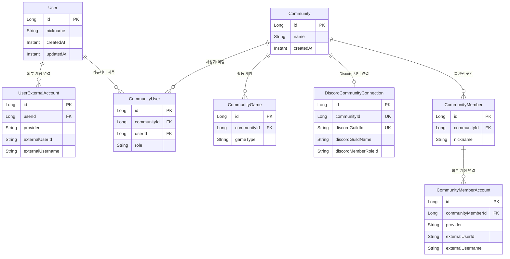
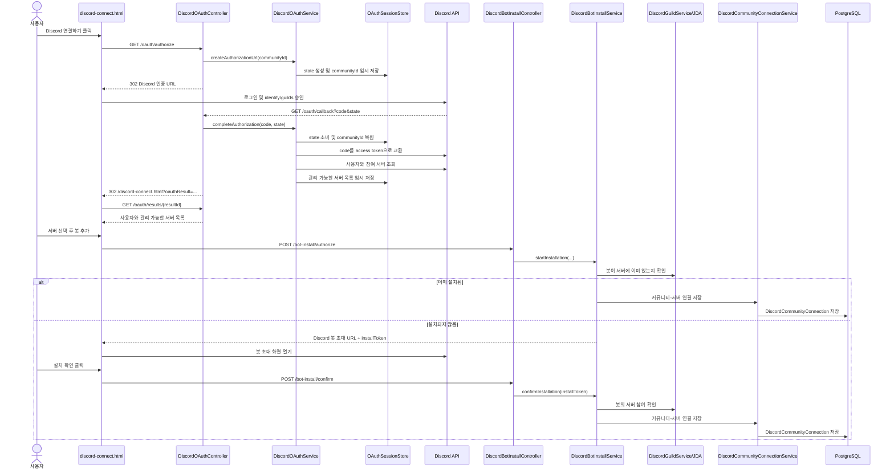
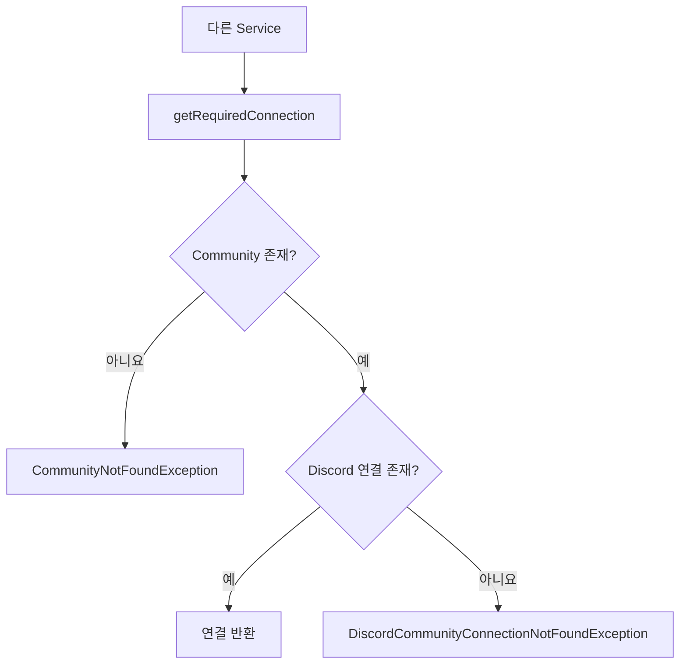
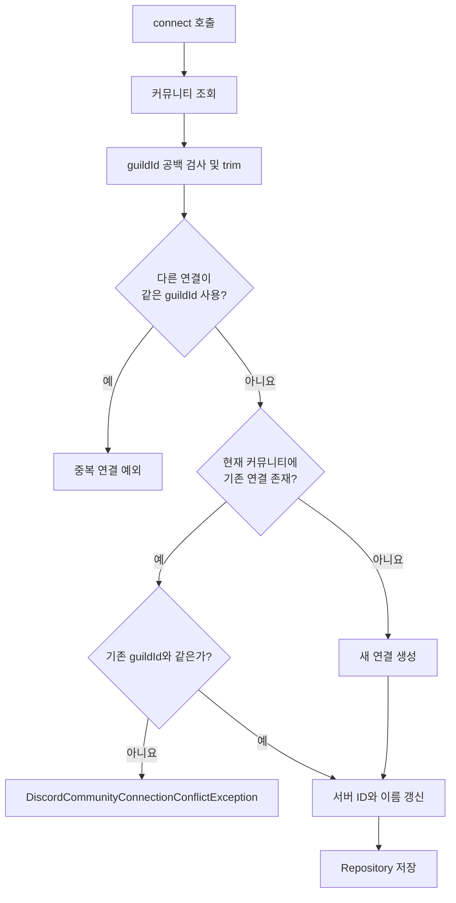
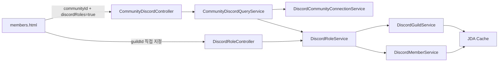
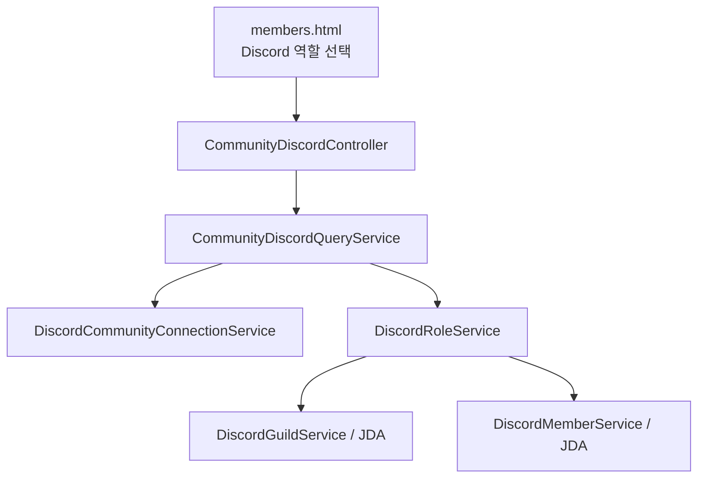

> Community 선택·대시보드 및 Session 접근 권한의 최신 흐름은 [COMMUNITY_NAVIGATION.md](COMMUNITY_NAVIGATION.md)를 참고하세요. 기존 전체 Community 목록 API도 이제 로그인 사용자의 소속만 반환합니다.

# GuildUp 백엔드 구조와 실행 흐름

이 문서는 GuildUp 백엔드에서 요청이 어느 파일로 들어가고, 어떤 서비스를 거쳐 DB 또는 Discord로 전달되는지 설명한다.

전체 엔드포인트의 요청/응답 예시와 기능 설명은 [API 명세](API.md)를 참고한다.

## 1. 전체 구조



각 계층의 책임은 다음과 같다.

| 계층 | 위치 | 역할 |
|---|---|---|
| 화면 | `src/main/resources/static` | 버튼 이벤트 처리, API 호출, 결과 표시 |
| Controller | `*/controller` | URL을 Java 메서드에 연결하고 요청/응답 DTO를 전달 |
| Service | `*/service` | 중복 검사, 권한 검사, 연결, 조회 등 실제 업무 흐름 처리 |
| Repository | `*/repository` | JPA를 이용해 PostgreSQL 조회 및 저장 |
| Domain | `*/domain` | DB 테이블과 연결되는 엔티티 및 상태 변경 메서드 |
| DTO | `*/dto` | HTTP 또는 Discord API에서 주고받는 데이터 형태 |
| Store | `discord/oauth/store` | OAuth와 봇 설치 중 필요한 단기 데이터를 메모리에 보관 |

## 2. 주요 데이터 관계



- `User`는 GuildUp 자체 사용자이며 Discord 사용자를 직접 의미하지 않는다.
- `CommunityUser`는 GuildUp 사용자와 커뮤니티의 관리 관계다.
- `CommunityMember`는 커뮤니티에서 관리하는 실제 클랜원이다.
- 커뮤니티 하나는 `CommunityGame`을 통해 여러 게임을 가질 수 있다.
- 커뮤니티 하나는 Discord 서버를 최대 하나만 연결할 수 있다.
- Discord 서버 하나도 GuildUp 커뮤니티 하나에만 연결할 수 있다.
- 직접 등록한 클랜원은 `CommunityMemberAccount`가 없다.
- `CommunityMemberAccount`는 GuildUp 멤버와 외부 계정을 명시적으로 연결할 때만 사용한다.
- Discord 역할 멤버 실시간 조회는 `CommunityMember`나 `CommunityMemberAccount`를 생성하지 않는다.
- `Community`에는 외부 서비스별 식별자를 저장하지 않는다. Discord 연결은 `DiscordCommunityConnection`에 저장한다.

## 3. Discord 계정 인증 및 서버 연결

시작 주소 예시:

```text
/discord-connect.html?communityId=1
```



### 3.1 사용자 OAuth 단계

1. `discord-connect.html`
   - `connect-button` 클릭을 감지한다.
   - `/api/communities/{communityId}/discord/oauth/authorize`로 브라우저를 이동한다.

2. `DiscordOAuthController.authorize()`
   - `DiscordOAuthService.createAuthorizationUrl()`을 호출한다.
   - 생성된 Discord 주소를 `Location` 헤더에 넣어 `302 Found`를 반환한다.

3. `DiscordOAuthService.createAuthorizationUrl()`
   - `CommunityRepository`로 커뮤니티 존재 여부를 확인한다.
   - `DiscordOAuthSessionStore`에 `state → communityId`를 10분 동안 저장한다.
   - `identify guilds` 범위를 요청하는 Discord 인증 URL을 만든다.

4. `DiscordOAuthController.callback()`
   - Discord가 전달한 일회용 `code`와 요청 검증용 `state`를 받는다.
   - 인증 완료 후 `/discord-connect.html?communityId=...&oauthResult=...`로 다시 리다이렉트한다.

5. `DiscordOAuthService.completeAuthorization()`
   - `state`를 한 번만 소비하고 원래 `communityId`를 복원한다.
   - `DiscordApiClient`를 이용해 `code`를 액세스 토큰으로 교환한다.
   - 로그인 사용자와 참여 서버 목록을 Discord에서 조회한다.
   - 서버 소유자이거나 `Administrator`, `Manage Guild` 권한이 있는 서버만 남긴다.
   - 사용자와 서버 목록을 결과 ID로 5분 동안 임시 저장한다.

6. `discord-connect.html.loadOAuthResult()`
   - 결과 조회 API를 호출해 계정과 서버 선택 목록을 렌더링한다.
   - 실제 Discord 액세스 토큰은 브라우저에 전달되지 않는다.

### 3.2 봇 설치 단계

1. 사용자가 서버를 선택하면 `DiscordBotInstallController.authorize()`를 호출한다.
2. `DiscordBotInstallService.startInstallation()`은 브라우저가 보낸 `guildId`를 그대로 믿지 않고 OAuth 결과의 관리 가능 서버 목록과 대조한다.
3. `DiscordGuildService`가 JDA에서 서버를 찾으면 봇이 이미 설치된 상태이므로 바로 연결을 저장한다.
4. 서버를 찾지 못하면 선택 서버가 고정된 Discord 봇 초대 URL과 10분짜리 `installToken`을 반환한다.
5. 사용자가 봇 초대를 마치고 설치 확인을 누르면 `confirmInstallation()`이 JDA에서 서버를 다시 확인한다.
6. 설치 직후 JDA 반영 지연을 고려해 기본적으로 500ms 간격으로 최대 5회 확인한다.
7. 확인에 성공하면 `DiscordCommunityConnectionService.connect()`로 DB 연결을 저장하고 설치 토큰을 제거한다.

## 4. DiscordCommunityConnectionService 상세

이 서비스는 다른 기능이 `communityId`만 알고 있어도 연결된 `discordGuildId`를 안전하게 찾을 수 있도록 중간 다리 역할을 한다.



### `getRequiredConnection(communityId)`

- 먼저 `CommunityRepository.existsById()`로 커뮤니티가 존재하는지 확인한다.
- `DiscordCommunityConnectionRepository.findByCommunityId()`로 연결 테이블을 조회한다.
- 연결이 없으면 연결 미설정 예외를 발생시킨다.

### `connect(communityId, discordGuildId, discordGuildName)`



중요한 규칙:

- 빈 Discord 서버 ID는 허용하지 않는다.
- 다른 커뮤니티가 사용 중인 Discord 서버는 다시 연결할 수 없다.
- 한 번 연결된 커뮤니티를 다른 Discord 서버로 바꾸는 것도 허용하지 않는다.
- 같은 서버로 다시 연결하면 서버 이름 등 정보를 갱신한다.
- Discord 서버 중복 여부는 `DiscordCommunityConnectionRepository`에서 검사한다.

이 서비스를 호출하는 곳:

| 호출 파일 | 호출 목적 |
|---|---|
| `DiscordBotInstallService` | 봇 설치 확인 후 커뮤니티와 Discord 서버 연결 저장 |
| `CommunityService` | 커뮤니티에 연결된 Discord 서버의 멤버 역할 설정 |
| `CommunityDiscordQueryService` | communityId를 discordGuildId로 바꿔 역할/멤버 조회 |

## 5. Discord 역할과 멤버 조회

역할 조회에는 두 진입 경로가 있다.



- 커뮤니티 기반 API는 저장된 연결을 먼저 찾아 Discord 서버 ID로 변환한다.
- 직접 조회 API는 URL의 `guildId`를 바로 사용한다.
- `DiscordRoleService.getRoles()`는 `@everyone`을 제외하고 역할 위치가 높은 순서로 반환한다.
- `DiscordRoleService.getMembers()`는 역할을 검증하고 봇이 아닌 사용자만 표시 이름 순으로 반환한다.
- 표시 이름은 서버 별명 → Discord 전역 표시 이름 → 사용자 이름 순서로 선택한다.

## 6. GuildUp 클랜원과 Discord 실시간 조회

### 수동 등록

```text
members.html
  → POST /api/communities/{communityId}/members
  → CommunityMemberController.addMember()
  → CommunityMemberService.addMember()
  → CommunityMemberRepository.save()
  → PostgreSQL
```

수동 등록 멤버는 닉네임만 가지며 외부 계정 연결이 없다. Discord 실시간 조회 결과와 자동으로 합쳐지지 않는다.

### Discord 역할 멤버 실시간 조회



역할 탭을 선택할 때마다 연결된 Discord 서버 ID를 조회한 뒤 JDA에서 역할 멤버를 읽어 응답 DTO로 변환한다. 봇 계정은 제외하고, 표시 이름은 서버 별명 → Discord 전역 표시 이름 → 사용자 이름 순서로 선택한다. 이 흐름에서는 멤버 관련 Repository를 호출하지 않으며 DB 데이터를 생성, 수정하거나 삭제하지 않는다.

## 7. API와 담당 코드

| HTTP API | Controller | Service | 최종 접근 대상 |
|---|---|---|---|
| `POST /api/communities` | `CommunityController` | `CommunityService` | Community DB |
| `GET /api/communities` | `CommunityController` | `CommunityService` | Community DB |
| `PUT /api/communities/{id}/discord-member-role` | `CommunityController` | `CommunityService` | Discord 연결 DB |
| `POST /api/communities/{id}/members` | `CommunityMemberController` | `CommunityMemberService` | Member DB |
| `GET /api/communities/{id}/members` | `CommunityMemberController` | `CommunityMemberService` | Member DB |
| `GET /api/communities/{id}/discord/oauth/authorize` | `DiscordOAuthController` | `DiscordOAuthService` | Discord OAuth |
| `GET /api/discord/oauth/callback` | `DiscordOAuthController` | `DiscordOAuthService` | Discord API + 메모리 Store |
| `GET /api/communities/{id}/discord/oauth/results/{resultId}` | `DiscordOAuthController` | `DiscordOAuthService` | 메모리 Store |
| `POST /api/communities/{id}/discord/bot-install/authorize` | `DiscordBotInstallController` | `DiscordBotInstallService` | OAuth Store + JDA |
| `POST /api/discord/bot-install/confirm` | `DiscordBotInstallController` | `DiscordBotInstallService` | JDA + 연결 DB |
| `GET /api/communities/{id}/discord/roles` | `CommunityDiscordController` | `CommunityDiscordQueryService` | 연결 DB + JDA |
| `GET /api/communities/{id}/discord/roles/{roleId}/members` | `CommunityDiscordController` | `CommunityDiscordQueryService` | 연결 DB + JDA |
| `GET /api/discord/guilds/{guildId}/roles` | `DiscordRoleController` | `DiscordRoleService` | JDA |
| `GET /api/discord/guilds/{guildId}/roles/{roleId}/members` | `DiscordRoleController` | `DiscordRoleService` | JDA |

## 8. 외부 연결과 설정

### PostgreSQL

`application.properties`의 `spring.datasource.*` 설정을 사용한다. 핵심 JPA 엔티티는 `User`, `UserExternalAccount`, `Community`, `CommunityUser`, `CommunityGame`, `DiscordCommunityConnection`, `CommunityMember`, `CommunityMemberAccount`다.

### Discord 사용자 OAuth

다음 환경변수가 필요하다.

| 환경변수 | 용도 |
|---|---|
| `DISCORD_CLIENT_ID` | 사용자 OAuth URL과 봇 초대 URL 생성 |
| `DISCORD_CLIENT_SECRET` | 인증 코드를 액세스 토큰으로 교환 |
| `DISCORD_REDIRECT_URI` | Discord 인증 후 돌아올 백엔드 콜백 주소 |

`DISCORD_REDIRECT_URI`는 일반적으로 다음 API를 가리켜야 하며 Discord Developer Portal 설정과 정확히 일치해야 한다.

```text
http://localhost:8080/api/discord/oauth/callback
```

### Discord 봇/JDA

`DISCORD_BOT_TOKEN`으로 JDA에 로그인한다. 서버 멤버와 역할을 조회하기 위해 `GUILD_MEMBERS` Gateway Intent, 전체 멤버 캐시와 청킹을 활성화한다.

## 9. 메모리 저장소 주의사항

현재 OAuth 상태, OAuth 결과, 봇 설치 토큰은 DB나 Redis가 아닌 애플리케이션 메모리에 저장된다.

| 임시 데이터 | 유효 시간 | 사용 시점 |
|---|---:|---|
| OAuth `state` | 10분 | Discord 콜백에서 한 번 소비 |
| OAuth 결과 | 5분 | 서버 선택/봇 설치 시작 시 소비 |
| 봇 `installToken` | 10분 | 봇 설치 확인 성공 후 제거 |

따라서 다음 특성이 있다.

- 애플리케이션을 재시작하면 진행 중인 인증과 설치 정보가 사라진다.
- 서버 인스턴스를 여러 개 운영하면 다른 인스턴스로 전달된 콜백이 임시 데이터를 찾지 못할 수 있다.
- 다중 인스턴스 운영 시에는 Redis처럼 모든 인스턴스가 공유하는 저장소 구현을 고려해야 한다.

## 10. 파일을 읽는 추천 순서

Discord 연결 흐름을 이해하려면 아래 순서로 읽는 것이 가장 자연스럽다.

1. `static/discord-connect.html`
2. `DiscordOAuthController`
3. `DiscordOAuthService`
4. `DiscordApiClient`
5. `InMemoryDiscordOAuthSessionStore`
6. `DiscordBotInstallController`
7. `DiscordBotInstallService`
8. `DiscordCommunityConnectionService`
9. `DiscordCommunityConnection`
10. `DiscordGuildService`와 `DiscordConfig`

클랜원 기능은 아래 순서로 읽는다.

1. `static/members.html`
2. `CommunityMemberController`
3. `CommunityMemberService`
4. `CommunityDiscordQueryService`
5. `DiscordRoleService`
6. `DiscordGuildService`와 `DiscordMemberService`
7. 각 Repository와 Domain
